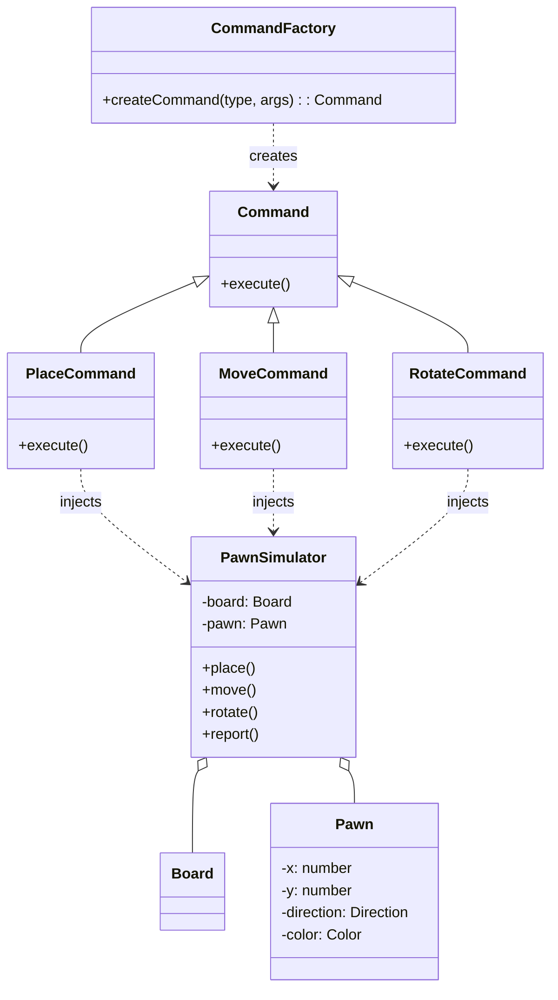

# Pawn Simulator Web

## Table of Contents

- [Pawn Simulator Web](#pawn-simulator-web)
  - [Table of Contents](#table-of-contents)
  - [Overview](#overview)
  - [Software Design Architecture](#software-design-architecture)
    - [Design Pattern](#design-pattern)
  - [Getting Started](#getting-started)
    - [Prerequisites](#prerequisites)
    - [Installation](#installation)
    - [Running the App](#running-the-app)
  - [Testing](#testing)
    - [Unit Tests](#unit-tests)
    - [E2E Tests](#e2e-tests)
      - [Prerequisites](#prerequisites-1)
      - [Run E2E test](#run-e2e-test)
  - [Project Structure](#project-structure)
  - [Environment Variables](#environment-variables)

## Overview

Pawn Simulator Web is an interactive web application that allows users to simulate the movement of a pawn on a virtual board. Users can issue commands to place, move, and rotate the pawn, and view the results.

## Software Design Architecture

It consists of two parts - UI(React) controller and Pawn Simulator service logic.

### Design Pattern

The PawnSimulator is architected with an object-oriented approach and leverages several key design patterns to ensure modularity, extensibility, and maintainability:

- **Command Pattern:** Each action (place, move, rotate) is encapsulated as a dedicated Command class (e.g., `PlaceCommand`, `MoveCommand`, `RotateCommand`). This enables flexible command execution, clear separation of concerns, and easy extension of new commands.

- **Factory Pattern:** The `CommandFactory.ts` centralizes the creation of Command objects, simplifying the process of adding or modifying commands without impacting client code.
- **Dependency Injection:** Dependencies (such as the `PawnSimulator` instance) are injected into Command classes, promoting loose coupling and making the system easier to test, extend, and maintain, especially for interactions between Commands and the PawnSimulator core logic.



_Class relationships:_

- `PawnSimulator` executes commands and manages the board.
- `CommandFactory` creates command instances.
- Each command (Place, Move, Rotate) implements `Command` and receives a reference to `PawnSimulator` (dependency injection).
- `Board` manages the pawn's state and is used by `PawnSimulator`.

## Getting Started

### Prerequisites

- Node.js >= 22.x

### Installation

```sh
npm install
```

### Running the App

```sh
npm run dev
```

## Testing

### Unit Tests

```sh
npm run test
```

### E2E Tests

#### Prerequisites

Install playwright browser

```sh
npx playwright install
```

#### Run E2E test

Before running E2E test locally, don't forget to do `npm run dev` first.

- Headless: `npm run test:e2e`
- Headed: `npm run test:e2e:head`
- UI Mode: `npm run test:e2e:ui`

## Project Structure

```
src/
  components/
  services/
  stores/
  types/
  utils/
test/
  unit/
  e2e/
```

## Environment Variables

- See `.env.sample` for required variables.
